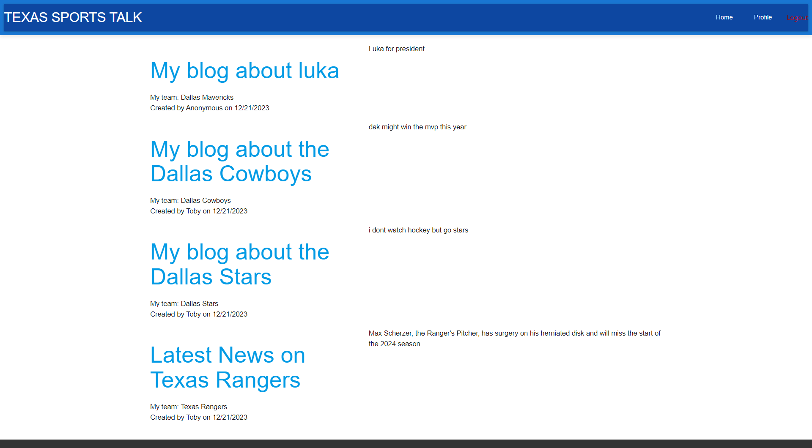

  ## Texas Sports Talk      
  
  ## Description
  This is a blog discussing Texas sports from all leagues around the Lone Star State. Users are able to sign up for an account and post content under their respective username.
  
  ## Table of Contents
  - [Installation](#installation)
  - [Usage](#usage)
  - [License](#license)
  - [Contributing](#contributing)
  - [Tests](#tests)
  - [Questions](#questions)
  
  ## Installation
  Any user can clone the repository provided here "https://github.com/Lindsayagreen/sportsblog-p2.git". Please make sure you download correct dependencies for your package-json file by using npm install.
  
  ## Usage
  User friendly for all devices and all Texas sport enthusiast.
  
  ## License
  None
  
  ## Contributing
  Contributing writers are Lauren Morrison, Terrence McCarthy, Ernest Beecherl, Christian Saleh, and Lindsay Green
  
  ## Technologies Used
  Materialize, Bcrypt, session-sequalize, dotenv, express, express-handlebars,express-session, mysql2

  ## Questions
   Email [lindsgree@gmail.com, Lauren.morrison00@gmail.com, terrencemccarthysnkrs@gmail.com, Christianmsaleh@gmail.com, ernestbeecherl98@gmail.com](mailto:lindsgree@gmail.com)

  ## Deployed Application

  * Screenshot

  